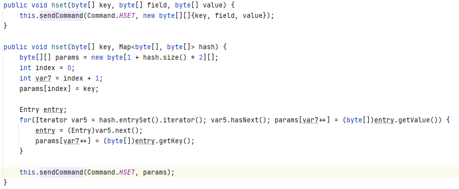
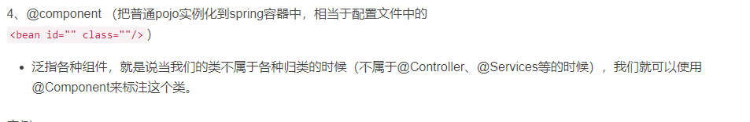
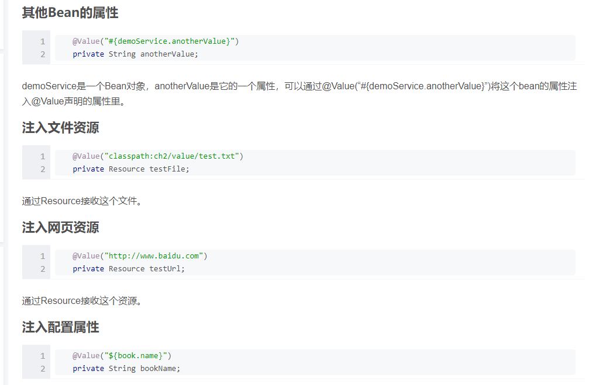
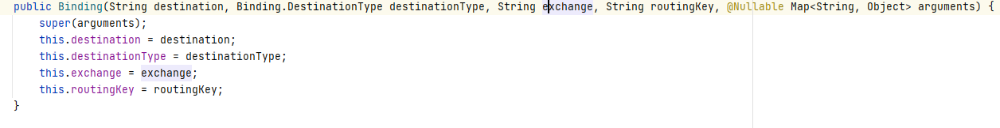
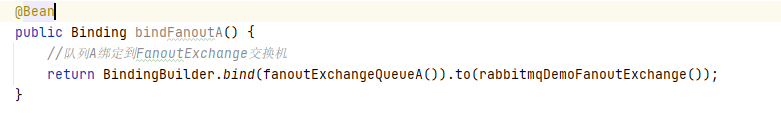
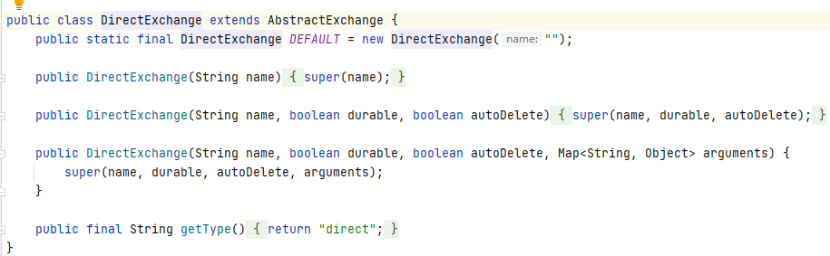
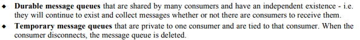

# redis


[link](https://www.cnblogs.com/leskang/p/7840603.html)

以下所有的指令都是console模式的。并发jedis。

### key操作
```
● exists(key)：确认一个key是否存在
● del(key)：删除一个key
● type(key)：返回值的类型
● keys(pattern)：返回满足给定pattern的所有key
● randomkey：随机返回key空间的一个
● keyrename(oldname, newname)：重命名key
● dbsize：返回当前数据库中key的数目
● expire：设定一个key的活动时间（s）
● ttl：获得一个key的活动时间
● select(index)：按索引查询
● move(key, dbindex)：移动当前数据库中的key到dbindex数据库
● flushdb：删除当前选择数据库中的所有key
● flushall：删除所有数据库中的所有key
```
### string
```
append key： 将key对应的values总追加某个值。
incr key：将key中对应的value的值加一
decr key：将key中对应的值减一
getrange key 0 2：取出key对应value中的0-2范围对应的值，类似于 between and
incrby key 2:多步递增
decrby key 2:多步递减
setrange key 0 xxx :从0位开始在后面补xxx
setex key time value:给设置一个key并且给他指定过期时间.(setwithexpire)
setnx key value:如果不存在设置一个key-value

```

### set
string类型，无序，唯一性，实现基于hash表最大的成员个数$2^{31}-1$
```
● sadd(key, member)：向名称为key的set中添加元素member
● srem(key, member) ：删除名称为key的set中的元素member
● spop(key) ：随机返回并删除名称为key的set中一个元素
● smove(srckey, dstkey, member) ：移到集合元素
● scard(key) ：返回名称为key的set的基数
● sismember(key, member) ：member是否是名称为key的set的元素
● sinter(key1, key2,…key N) ：求交集
● sinterstore(dstkey, (keys)) ：求交集并将交集保存到dstkey的集合
● sunion(key1, (keys)) ：求并集
● sunionstore(dstkey, (keys)) ：求并集并将并集保存到dstkey的集合
● sdiff(key1, (keys)) ：求差集
● sdiffstore(dstkey, (keys)) ：求差集并将差集保存到dstkey的集合
● smembers(key) ：返回名称为key的set的所有元素
● srandmember(key) ：随机返回名称为key的set的一个元素
```

```java
public void setCrud(){
        String key1="set1",key2="set2";

        //添加
       jedis.sadd("set2",get(),get1(),get3());

       {//查找
           Set<String> sstr = jedis.smembers("myset");
           System.out.println(sstr);
       }

       {   //删除
           jedis.srem("myset","528272844362530834");
       }

       {//随机删除一个并且返回
           String v = jedis.spop(key1);
           System.out.println(v);
       }
        jedis.close();
    }
```


### hash
hash储存的是一个string 类型的 field（字段） 和 value（值） 的映射表。大小同上，有意思的是如何储存。
```
● hset(key, field, value)：向名称为key的hash中添加元素field
● hget(key, field)：返回名称为key的hash中field对应的value
● hmget(key, (fields))：返回名称为key的hash中field i对应的value
● hmset(key, (fields))：向名称为key的hash中添加元素field
● hincrby(key, field, integer)：将名称为key的hash中field的value增加integer
● hexists(key, field)：名称为key的hash中是否存在键为field的域
● hdel(key, field)：删除名称为key的hash中键为field的域
● hlen(key)：返回名称为key的hash中元素个数
● hkeys(key)：返回名称为key的hash中所有键
● hvals(key)：返回名称为key的hash中所有键对应的value
● hgetall(key)：返回名称为key的hash中所有的键（field）及其对应的value
```



Java的jedis中有2种hset，第一种和console模式一样第二种则map的。


这里的map实际上先转化成map byte然后再转化成行指令在调用hmset，不过hset也可以进行这个操作，hmset在4.0.0后不建议使用。

### list
```
● rpush(key, value)：在名称为key的list尾添加一个值为value的元素
● lpush(key, value)：在名称为key的list头添加一个值为value的 元素
● llen(key)：返回名称为key的list的长度
● lrange(key, start, end)：返回名称为key的list中start至end之间的元素
● ltrim(key, start, end)：截取名称为key的list
● lindex(key, index)：返回名称为key的list中index位置的元素
● lset(key, index, value)：给名称为key的list中index位置的元素赋值
● lrem(key, count, value)：删除count个key的list中值为value的元素
● lpop(key)：返回并删除名称为key的list中的首元素
● rpop(key)：返回并删除名称为key的list中的尾元素
● blpop(key1, key2,… key N, timeout)：lpop命令的block版本。
● brpop(key1, key2,… key N, timeout)：rpop的block版本。
● rpoplpush(srckey, dstkey)：返回并删除名称为srckey的list的尾元素，并将该元素添加到名称为dstkey的list的头部
```

### sort set

```
SortedSet（有序集合）
ZADD key score member [[score member] [score member] ...] //将一个或多个 member 元素及其 score 值加入到有序集 key 当中,score 值可以是整数值或双精度浮点数。
ZRANGE key start stop [WITHSCORES] //返回有序集 key 中，指定区间内的成员,位置按 score 值递增(从小到大)来排序,递增排列。
ZREVRANGE key start stop [WITHSCORES] //返回有序集 key 中，指定区间内的成员,位置按 score 值递减(从大到小)来排列,递减排列。
ZRANK key member //返回有序集 key 中成员 member 的排名(返回值+1)。其中有序集成员按 score 值递增(从小到大)顺序排列,score值最小的成员排名为0。
ZREVRANK key member  //返回有序集key中成员 member 的排名(返回值+1)。其中有序集成员按score值递减(从大到小)排序,score 值最大的成员排名为 0 。
ZCARD key //返回有序集 key 的基数。
ZREM key member [member ...] //移除有序集 key 中的一个或多个成员，不存在的成员将被忽略。
ZSCORE key member //返回有序集 key 中，成员 member 的 score 值。
ZRANGEBYSCORE key min max [WITHSCORES] [LIMIT offset count] //返回有序集 key 中，所有 score 值介于 min 和 max 之间(包括等于 min 或 max )的成员。有序集成员按 score 值递增(从小到大)次序排列。min 和 max 可以是 -inf 和 +inf ，这样一来，你就可以在不知道有序集的最低和最高 score 值的情况下，使用 ZRANGEBYSCORE 这类命令。ZRANGEBYSCORE zset (5 (10 表示返回所有符合条件 5 < score < 10 的成员。ZRANGEBYSCORE salary -inf 5000 WITHSCORES    # 显示工资 <=5000 的所有成员
ZCOUNT key min max //返回有序集 key 中， score 值在 min 和 max 之间(默认包括 score 值等于 min 或 max )的成员的数量。
ZINCRBY key increment member //为有序集 key 的成员 member 的 score 值加上增量 increment 。
ZREMRANGEBYRANK key start stop //移除有序集 key 中，指定排名(rank)区间内的所有成员,以 0 表示有序集第一个成员,-1 表示最后一个成员。
ZREMRANGEBYSCORE key min max //移除有序集 key 中，所有 score 值介于 min 和 max 之间(包括等于 min 或 max )的成员。
ZREVRANGEBYSCORE key max min [WITHSCORES] [LIMIT offset count] //返回有序集 key 中， score 值介于 max 和 min 之间(默认包括等于 max 或 min )的所有的成员。有序集成员按 score 值递减(从大到小)的次序排列。
ZUNIONSTORE destination numkeys key [key ...] [WEIGHTS weight [weight ...]] [AGGREGATE SUM|MIN|MAX] //计算给定的一个或多个有序集的并集，其中给定 key 的数量必须以 numkeys 参数指定，并将该并集(结果集)储存到 destination 。
ZINTERSTORE destination numkeys key [key ...] [WEIGHTS weight [weight ...]] [AGGREGATE SUM|MIN|MAX] //计算给定的一个或多个有序集的交集，其中给定 key 的数量必须以 numkeys 参数指定，并将该交集(结果集)储存到 destination 。
```

## redis的spring用法
**快速测试**
```java
    public static void main(String[] args) {
        //连接本地的 Redis 服务
        Jedis jedis = new Jedis("http://localhost:6379");
        jedis.auth("douqu");
        System.out.println("连接成功");
        //查看服务是否运行
        System.out.println("服务正在运行: "+jedis.ping());
        System.out.println("======================key==========================");
        //清除当前数据库所有数据
        jedis.flushDB();
        //设置键值对
        jedis.set("xiaohua","我是小花");
        //查看存储的键的总数
        System.out.println(jedis.dbSize());
        //取出设置的键值对并打印
        System.out.println(jedis.get("xiaohua"));

//        RedisCache redisCache=new RedisCache();
//        redisCache.putCache("hello","xxx");


    }
```

**redistemplate**
```xml
<!--redis-->
		<dependency>
			<groupId>org.springframework.data</groupId>
			<artifactId>spring-data-redis</artifactId>
			<version>2.3.1.RELEASE</version>
		</dependency>

		<dependency>
			<groupId>redis.clients</groupId>
			<artifactId>jedis</artifactId>
		</dependency>

		<dependency>
			<groupId>org.springframework.boot</groupId>
			<artifactId>spring-boot-starter-data-redis</artifactId>
		</dependency>
```
```yml
spring:
  redis:
    cache:
      port: 6379
      host: 127.0.0.1
#      database: 1
      password: 123456
```
```java
//1、通过redisTemplate设置值
redisTemplate.boundValueOps("StringKey").set("StringValue");
redisTemplate.boundValueOps("StringKey").set("StringValue",1, TimeUnit.MINUTES);

//2、通过BoundValueOperations设置值
BoundValueOperations stringKey = redisTemplate.boundValueOps("StringKey");
stringKey.set("StringVaule");
stringKey.set("StringValue",1, TimeUnit.MINUTES);

//3、通过ValueOperations设置值
ValueOperations ops = redisTemplate.opsForValue();
ops.set("StringKey", "StringVaule");
ops.set("StringValue","StringVaule",1, TimeUnit.MINUTES);

```

**更新后用法**

学了2天设计模式了，所以针对这个问题，我们先需要分析redis该如何设计才合理，首先他的过程是连接然后使用。那么问题来了，我们可能有很多种的使用方式，比如针对一个服务使用一个redis。我们这里可以使用工厂模式，首先是设计一个基础的连接返回连接，然后在针对不同的连接模式设置工厂，最后在实际中生成所需的redis实例。


连接逻辑
```java
package com.example.demo.liuyi.component.cache.config;

import org.springframework.context.annotation.Configuration;
import org.springframework.data.redis.connection.RedisConnectionFactory;
import org.springframework.data.redis.connection.RedisStandaloneConfiguration;
import org.springframework.data.redis.connection.jedis.JedisConnectionFactory;
import org.springframework.stereotype.Component;

@Configuration
public class redisConfig {
    protected RedisConnectionFactory createConnectionFactory(String host, int port, String password) {
        RedisStandaloneConfiguration configuration =
                new RedisStandaloneConfiguration(host, port);

        configuration.setPassword(password);
        return new JedisConnectionFactory(configuration);
    }
}

```
实际的缓存连接
```Java
package com.example.demo.liuyi.component.cache.config;

import org.springframework.beans.factory.annotation.Value;
import org.springframework.context.annotation.Bean;
import org.springframework.context.annotation.Configuration;
import org.springframework.data.redis.connection.RedisConnectionFactory;
import org.springframework.data.redis.core.RedisTemplate;
import org.springframework.data.redis.core.StringRedisTemplate;

@Configuration
public class RedisCacheTemplateConfig extends redisConfig{
    @Value("${spring.redis.cache.host}")
    private String host;
    @Value("${spring.redis.cache.port}")
    private Integer port;
    @Value("${spring.redis.cache.password}")
    private String password;

    @Bean()
    public RedisConnectionFactory cacheRedisConnectionFactory() {
        return createConnectionFactory(host, port, password);
    }

    @Bean(RedisTemplateConstant.CacheRedisTemplate)
    public RedisTemplate<String, String> redisTemplate(){
        RedisTemplate<String, String> redisTemplate = new StringRedisTemplate();
        redisTemplate.setConnectionFactory(cacheRedisConnectionFactory());
        return redisTemplate;
    }
}
```
拿到相关的bean
```java
@Component("RedisCache")
public class RedisCache extends RedisCacheCore {

    @Qualifier(RedisTemplateConstant.CacheRedisTemplate)
    @Autowired
    private RedisTemplate<String, String> redisTemplate;

    @PostConstruct
    public void init(){
        super.setRedisTemplate(redisTemplate);
    }
}

```
这样我们可以针对不同的需求连接不同的，这样你需要用那个template只需要从ioc容器中拿到即可。

**database**

这个参数设置我一开始不知道。导致我在redis-cli里面一直查不到我想要的东西，而且服务端没有任何的报错所以就感觉不对劲，而我查找这个数据库里面的一个key还是null，一度怀疑人生，是不是这个世界错了。后来仔细了解这个参数后，才发现redis也有数据库这个概念，而且是相互隔离的，我使用的是1，但是default是0.
所以导致这个问题存在，在redis-cli里面切换database的命令是select。


# Java基础
**位运算**

位运算可以做很多事情，可以解决很多算法，也可以用来完成协议。按照理论来说可以这么定义一个协议，把协议定位多少位，我们可以来假装设定一个协议，比如选择搭配的衣服种类。
```Java
public class protecl {
    static int upcloth=4;//不超过16件衣服
    static int downcloth=4;
    static int shose=3;
    public int setCloth(int up,int down,int sho){
        Integer _up=(up%(1<<upcloth))<<(downcloth+shose);
        Integer _down=(down%(1<<downcloth))<<shose;
        return _up+_down+sho%(1<<shose);
    }
    public int get(Integer prot){

        Integer sho=prot&((1<<shose)-1);
        prot=prot>>3;
        int down=prot&((1<<downcloth)-1);
        return 0;
    }

    public static void main(String[] args) {
        protecl p=new protecl();
        int c=p.setCloth(11,8,5);
        p.get(c);
    }
}
```

其实这还可以用作id生成器，用long来说他是64位的，一个时间锉可以战48位其他的随意分配你想分配的，就可以生成一个唯一的id了，如果是innodb的话这就是主键了，所以你甚至可以根据这个来进行排序，作为唯一id你想通过人区别，就把人的唯一id放在最前面，你想通过时间，就把时间放在前面。

```java 

public class generateId {
    public static long fromtime(int uid){
        long date=System.currentTimeMillis();
        date=date<<16;
        date+=uid;
        return date;
    }
}

```

**LinkedBlockingQueue**

阻塞队列，尾部进入头部出去，2把锁头锁尾锁，可以2端同时进出，但是不能一端操作多次，同一时刻。
**ImmutableMap**

这里面的元素都是不会变的，所以插入key or value都不能是null。

**CountDownLatch**

类似于一个倒计时的工具，实现底层是共享锁，指定大小，然后调用.await()执行完后释放，继续执行之后的代码。

**LoadingCache**

缓存，在jvm里面的缓存

[link](https://blog.csdn.net/babylovewei/article/details/105556768)

```java
 private static LoadingCache<Long, String> loadCache(CacheLoader<Long, String> cacheLoader) throws Exception {
    LoadingCache<Long, String> cache = CacheBuilder.newBuilder()
        //缓存池大小，在缓存项接近该大小时， Guava开始回收旧的缓存项
        .maximumSize(GUAVA_CACHE_SIZE)
        //设置时间对象没有被读/写访问则对象从内存中删除(在另外的线程里面不定期维护)
        .expireAfterAccess(GUAVA_CACHE_DAY, TimeUnit.DAYS)
        // 设置缓存在写入之后 设定时间 后失效
        .expireAfterWrite(GUAVA_CACHE_DAY, TimeUnit.DAYS)
        //移除监听器,缓存项被移除时会触发
        .removalListener(new RemovalListener<Long, String>() {
          @Override
          public void onRemoval(RemovalNotification<Long, String> rn) {
            //逻辑操作
          }
        })
        //开启Guava Cache的统计功能
        .recordStats()
        .build(cacheLoader);
    return cache;
  }
```
## lambda
这个东西之前一直不理解存在的意义，很多地方都有这个。他的基本形式是
(parameters) -> expression
或
(parameters) ->{ statements; }

也就是闭包，他可以直接用形式接下来，也可以不。比如一个接口
```java
public interface HelloWorld {
    void sayHello(int s);
}

```
我们可以直接如下处理。
```java
    HelloWorld helloWorld=(s)->{System.out.println(s);};
```

这样相对于对helloword进行实例化。

所以这么写合情合理。
```java
la.PrintHello((s)->{System.out.println(s);});
```

为啥这玩意会存在了，你想想，如果我一个接口需要实现很多的不同的，但是只有一条，那么我需要对每个接口，会写很多多余的代码，而且闭包的位置近，代码明确，如果你写过，你就会发现一些问题，那就是代码调试难度增大，没有具体类可以跳转。

## NIO
https://tech.meituan.com/2016/11/04/nio.html

**所有io模型**


**reactor**

步骤1：等待事件到来（Reactor负责）。
步骤2：将读就绪事件分发给用户定义的处理器（Reactor负责）。
步骤3：读数据（用户处理器负责）。
步骤4：处理数据（用户处理器负责）。

**Proactor**

步骤1：等待事件到来（Proactor负责）。
步骤2：得到读就绪事件，执行读数据（现在由Proactor负责）。
步骤3：将读完成事件分发给用户处理器（Proactor负责）。
步骤4：处理数据（用户处理器负责）。

## 线程池

线程池在Java中是一个常见的存在，线程池的存在的意义在于，线程的的创建是需要调用操作系统层面的api，而操作系统创建一个线程的过程是需要进行好几个操作，基础的注册、创建线程专属的栈与寄存器等。而这个需要进行系统调用，系统调用需要把用户空间的数据copy到内核空间，核心态能使用的是一层操作系统封装的api，一般的c函数会比系统调用快1到2个数量级，也就是几十倍。如果频繁的创建和销毁线程，可能需要调用很多次系统调用导致速度不佳。

不同的业务场景对应不同的搭配选择。
**base code**
[link](https://tech.meituan.com/2020/04/02/java-pooling-pratice-in-meituan.html)
```java
//这是一个简单的demo，什么处理方式，队列呀那些的我就不讲了，给一个very nice的link
public class ThreadPool {
    public static Logger logger= LoggerFactory.getLogger(walk.class);
    public static class walk implements Runnable{
        public int getPersonId() {
            return personId;
        }

        public void setPersonId(int personId) {
            this.personId = personId;
        }

        public int personId;
        @Override
        public void run() {
            logger.info("第{}个人在走路",personId);
        }
    }
    public static void main(String[] args) throws InterruptedException {
        BlockingQueue queue=new ArrayBlockingQueue(8);
        ThreadFactory threadFactory=new TaskThreadFactory("liuyi-",true,1);
        ThreadPoolExecutor threadPoolExecutor=new ThreadPoolExecutor(8,32,120,TimeUnit.SECONDS,queue,threadFactory,new ThreadPoolExecutor.DiscardPolicy());
        for(int i=0;i<100;i++){
            walk w=new walk();
            w.setPersonId(i);
//            threadFactory.newThread(w);
            System.out.println(i);
            threadPoolExecutor.execute(w);
        }
        Thread.sleep(10*1000);
    }
}
```

# 序列化与反序列化
[link](https://tech.meituan.com/2015/02/26/serialization-vs-deserialization.html)
序列化和反序列化的意义在于可以将一些对象类型的数据进行传输并且进行储存在分布式时代意义巨大。


目前主流的序列化的格式有xml、json、Thrift、Protobuf、Avro等。如果仅仅有格式但是没有idl这种说明类型的文件也是不知道什么意思。所以大部分的都需要idl文件作为辅助结构。


```java
class Address
{
    private String city;
    private String postcode;
    private String street;
}
public class UserInfo
{
    private Integer userid;
    private String name;
    private List<Address> address;
}
```
**xml**

xml是符合soap的思想的。他的idl文件是wsdl
```xml
<xsd:complexType name='Address'>
     <xsd:attribute name='city' type='xsd:string' />
     <xsd:attribute name='postcode' type='xsd:string' />
     <xsd:attribute name='street' type='xsd:string' />
</xsd:complexType>
<xsd:complexType name='UserInfo'>
     <xsd:sequence>
     <xsd:element name='address' type='tns:Address'/>
     <xsd:element name='address1' type='tns:Address'/> 
     </xsd:sequence>
     <xsd:attribute name='userid' type='xsd:int' />
     <xsd:attribute name='name' type='xsd:string' /> 
</xsd:complexType>
```
**json**
```json
{"userid":1,"name":"messi","address":[{"city":"北京","postcode":"1000000","street":"wangjingdonglu"}]}
```

**thrift**

基于rpc框架
```c++
struct Address
{ 
    1: required string city;
    2: optional string postcode;
    3: optional string street;
} 
struct UserInfo
{ 
    1: required string userid;
    2: required i32 name;
    3: optional list<Address> address;
}
```

**Protobuf**
可以HTTP。
```java
message Address
{
	required string city=1;
    	optional string postcode=2;
    	optional string street=3;
}
message UserInfo
{
	required string userid=1;
	required string name=2;
	repeated Address address=3;
}
```

**arov**


总结多款相比下，xml看起来相当fw，但是是最清晰的。所以整体来说选择上是理解度和空间和协议支持的权衡，如果你的框架很完全不需要理解也不需要调试，那么选择二进制绝对是最省空间的选择，如果想要选择清晰度那么以上的框架基本都支持，json的不好在于不是很清晰，没有直接对应的文件支持，需要自己去解析，解析也是需要速度的。所以在不同的场景做不同的事情。

# quartz
quartz是用来执行定时任务的。

quartz的构成分为几个部分job，trigger，schedule。
job也就是定时执行的任务，而trigger是触发器，schedule是用来调度，可以设置组概念，这样就可以一任务多触发或者多次利用，组的概念其实很常见。


**代替品**

如果使用的是springboot那么就可以直接使用schedule的来进行操作，规则类似，不过需要在类上注释@EnableScheduling在加上想添加的注解类型。

## test
```xml
<!-- maven依赖没给就是有点坑 -->
		<dependency>
			<groupId>org.quartz-scheduler</groupId>
			<artifactId>quartz</artifactId>
			<version>2.3.2</version>
		</dependency>
```
```java
首先注册一个job重写他的execute。

package quartzTest;

import org.quartz.Job;
import org.quartz.JobExecutionContext;
import org.quartz.JobExecutionException;
import org.slf4j.Logger;
import org.slf4j.LoggerFactory;

public class quarz implements Job {
    private Logger log= LoggerFactory.getLogger(this.getClass());
    @Override
    public void execute(JobExecutionContext jobExecutionContext) throws JobExecutionException {
        log.info("嘤嘤嘤");
    }
}

public class simplerJob implements Job {
    private Logger log= LoggerFactory.getLogger(this.getClass());
    static int a=0;
    @Override
    public void execute(JobExecutionContext jobExecutionContext) throws JobExecutionException {
        log.info("我不做人了"+a);
        a+=1;
    }
}

```
```java
package quartzTest;

import org.quartz.*;
import org.quartz.impl.StdSchedulerFactory;

import java.util.Date;

import static org.quartz.SimpleScheduleBuilder.simpleSchedule;
import static org.quartz.TriggerBuilder.newTrigger;

public class mytrigger {
    public static void main(String[] args) {
        //工厂
        SchedulerFactory factory=new StdSchedulerFactory();
        try {
            //任务调度
            Scheduler scheduler=factory.getScheduler();
            //job
            JobDetail jobDetail= JobBuilder.newJob(quarz.class).withDescription("hello world").withIdentity("group1","liu").build();
            JobDetail SimplerjobDetail= JobBuilder.newJob(simplerJob.class).withDescription("hello world").withIdentity("group2","liu").build();
            //触发器
            Trigger trigger= newTrigger().
                    withIdentity("group1","mytirgger").
                    withDescription("hello trigger").
                    startAt(new Date(System.currentTimeMillis())).
                    withSchedule(CronScheduleBuilder.cronSchedule("0/4 * * * * ?")).
                    build();
            //绑定
            SimpleTrigger simpleTrigger = newTrigger()
                    .withIdentity("simpleTrigger", "group2")
                    .startAt(new Date(System.currentTimeMillis()))  // if a start time is not given (if this line were omitted), "now" is implied
                    .withSchedule(simpleSchedule()
                            .withIntervalInSeconds(1)
                            .withRepeatCount(10)) // note that 10 repeats will give a total of 11 firings
//                    .forJob(SimplerjobDetail) // identify job with handle to its JobDetail itself
                    .build();
            scheduler.scheduleJob(SimplerjobDetail,simpleTrigger);
            scheduler.scheduleJob(jobDetail,trigger);
//            scheduler.scheduleJob(s)
            scheduler.start();
        } catch (SchedulerException e) {
            e.printStackTrace();
        }
    }
}
```

## crone规则
[link](https://www.cnblogs.com/skyblue/p/3296350.html)


# spring
## 注解
### 如何产生新的注解

spring和Java自带的注解没有办法满足我们所有的需求，我们仍需要新的注解。

```java
@Target({ElementType.METHOD,ElementType.FIELD})
@Retention(RetentionPolicy.RUNTIME)
public @interface requireLogin {
    String name() default "";
}

然后就是设置拦截器他一般有3个部分。
public class loginRequireHandle implements HandlerInterceptor {
    @Override
    public boolean preHandle(HttpServletRequest request, HttpServletResponse response, Object handler) throws Exception {
        
        return false;
    }

    @Override
    public void postHandle(HttpServletRequest request, HttpServletResponse response, Object handler, ModelAndView modelAndView) throws Exception {

    }

    @Override
    public void afterCompletion(HttpServletRequest request, HttpServletResponse response, Object handler, Exception ex) throws Exception {

    }
}

然后就是注册拦截器了。

@Configuration
public class InterceptorTrainConfigurer implements WebMvcConfigurer {
    @Override
    public void addInterceptors(InterceptorRegistry registry) {
        registry.addInterceptor(new loginRequireHandle()).addPathPatterns("/**");
    }
}

他的逻辑是进入首先进入拦截器，然后进行prehandle判断能否进入，这个地方就可以设置注解的东西了。

   @Override
    public boolean preHandle(HttpServletRequest request, HttpServletResponse response, Object handler) throws Exception {
        System.out.println("进入拦截器了");
        HandlerMethod handlerMethod= (HandlerMethod) handler;
        requireLogin login=handlerMethod.getMethod().getAnnotation(requireLogin.class);
        if(login==null)
        return true;

        String name=request.getParameter("name");
        System.out.println(name);
        if(name.equals("liuyi"))
            return true;
        response.setContentType("application/json; charset=utf-8");
        response.getWriter().println("你所需的资源需要登陆");
        return false;
    }
    可以先判断有没有该注解，没有直接返回true有的话进一步判断逻辑，完成后返回结果。

```

**@ControllerAdvice**

这是对错误处理的截断，如果执行出错就会进行跳转到类里继续执行/

**@ExceptionHandler**

在上一条指令里面可以设置参数执行对应错误的放回。其实我以为如果这个在出错就会递归执行，但没想到我的想法被他看透了，出错了只能执行一次然后直接返回500抛出异常。

**@Service**

bean需要注入，通过service相当于做了2件事情将名字与类型进行注入，可以在后面指定他的id。他匹配过程是按照类型，如果需要按照id用@Qualifier 

**@Configuration**

配置了注入，类似于xml文件。@bean会在开始运行的时候自动运行。

**@Bean**

将函数生产的对象放入ioc容器中，把控制权限交给spring。

**@Component**



**@Transactional**

支持事务，可以进行回滚，支持多种事务。

[link](https://developer.ibm.com/zh/languages/java/articles/j-master-spring-transactional-use/)


个人理解：
注解可以是需要配置拦截器进入的，进入后会进行配置，拦截器前面讲到过的，而是用代理去操作肯定是有原因的，至于为啥也不知道。

**@Qualifier**

可以准确找到那个bean决定用那个bean进行实例化。

**@Order**

并不是控制bean初始化的时间，而是控制注入的顺序。

**@Value**



## end


# mybaits

[link1](https://www.kancloud.cn/digest/andyalien-mybatis/190189)

**trim**


**refid**

\<include refid="Base_Column_List"/>
\<sql id="Base_Column_List" >name,age\</sql>

就是把Base_Column_List里面的内容copy过来。

**resultmap**

设置返回结果的类似。

**select parament**


如果要返回list\<obejct>只需要设置类路径+object即可。
resultmap和resulttype不能同时存在。

## sql record

**DESC**

逆序，使某个字段按照逆序排列。

**order by**

可以按照某一列排序。
select * from table order by a,b,c
和联合索引类型。

**group by**

把一个字段相同的分在一起，然后进行一些操作。


# rabbitmq
参考链接
https://developer.aliyun.com/article/769883

消息队列优点。解耦、异步、削峰。

## 组成
Broker：消息队列服务进程。此进程包括两个部分：Exchange和Queue。
Exchange：消息队列交换机。按一定的规则将消息路由转发到某个队列。
Queue：消息队列，存储消息的队列。
Producer：消息生产者。生产方客户端将消息同交换机路由发送到队列中。
Consumer：消息消费者。消费队列中存储的消息。


## 函数

**Queue**


```
1. name队列名称
2. durable持久化，是队列持久化，并不是里面的消息持久化。
3. exclusive队列是否专属,专属的范围针对的是连接,也就是说,一个连接下面的多个信道是可见的.对于其他连接是不可见的.连接断开后,该队列会被删除.注意,不是信道断开,是连接断开.并且,就算设置成了持久化,也会删除.
4. autodelete//如果所有消费者都断开连接了,是否自动删除.如果还没有消费者从该队列获取过消息或者监听该队列,那么该队列不会删除.只有在有消费者从该队列获取过消息后,该队列才有可能自动删除(当所有消费者都断开连接,不管消息是否获取完)

最后一个是一个map
Message TTL : 消息生存期
Auto expire : 队列生存期
Max length : 队列可以容纳的消息的最大条数
Max length bytes : 队列可以容纳的消息的最大字节数
Overflow behaviour : 队列中的消息溢出后如何处理
Dead letter exchange : 溢出的消息需要发送到绑定该死信交换机的队列
Dead letter routing key : 溢出的消息需要发送到绑定该死信交换机,并且路由键匹配的队列
Maximum priority : 最大优先级
Lazy mode : 懒人模式
Master locator : 
## exchange
exchange是一种映射规则，将key指定到value这里就是queue。这样可以保证同样的key是有序的。
* direct
* fanout
* topic
* headers
```

**bind** 






这里网上资料很少，大概是把queue绑定到交换机上面去。还有路由键。应该就是路由链整个过程。

**convandsend**


### direct

**DirectExchange**


就是直接连接，发现相同的key就可以连接消费了。而且消息会被抢掉，如果没有及时的消费。
主要步骤

1. 建立tcp链接形成channel
2. 建立消息队列，交换机
3. 将消息队列和交换机链接
4. 通信

### fannot

这个交换机可以多订阅多发布，


### topic

topic相对于其他的exchange来说，他的roukey可以通过通字符匹配完成匹配。每个队列都有一个自己的名字。

### 消费者
这里可以指定队列进行消费。如果没有指定队列就不会进行消费。
```java
@Component
@RabbitListener(queuesToDeclare = @Queue(topConfig.TOPIC_EXCHANGE_QUEUE_A))
public class topicconsumer {
    @RabbitHandler
    public void getmsg(Map<String,Object> map){
        System.out.println(topConfig.TOPIC_EXCHANGE_QUEUE_A+map.toString());
    }
}

```

## 升入学习
### ack
有ack机制，需要返回，如果没有返回则认为消息没有消费成功，需要给别人继续消费。如果忘记返回ack会造成严重的错误。

http://www.iocoder.cn/RabbitMQ/good-collection/?vip


# git
git分布式版本控制器。


# error record
## Failed to determine a suitable driver class

[link](https://blog.csdn.net/buyaore_wo/article/details/80741159)

这里继续说没有合适的database。
错误原因是在initial的时候选择spring web的时候会导致连带jdbc选择而本机器未安装MySQL的就会导致错误。

1. 取消选择jdbc
2. 注解掉相关的maven依赖

## org.apache.ibatis.binding.BindingException: Invalid bound statement (not found)

[link]("https://blog.csdn.net/sundacheng1989/article/details/81630370")
基本涵盖。不过我是test里面，有同名文件导致的。

# 协议
协议的本质是一种标准，只有遵守了标准才能够进行沟通。
## 时间戳
时间戳本质上也是一种规定
T = ((X * 24 + hour) * 60 + min) * 60 + sec

x是从1970年1月1日开始的天数。
X = year/4 - year/100 + year/400 + 367*mon/12 + day + year *365 - 719499

## AMQP
https://www.rabbitmq.com/resources/specs/amqp0-9-1.pdf
Advanced Message Queuing Protocol（高级消息队列协议）
他很多概念和rabbitmq类似，因为是基于amqp协议开发的。


**queue**


**routkey**


**message flow**


如果消息到了但是没有标明队列可以选择丢掉或者返回给producer。消息到了之后会去找消费者，如果没有放入内存或者磁盘，知道消费为止。

**exchange type**


这里只有2种exchange而rabbitmq有4种，但是queue有3种。

**queue life**



**bindings**

```
Queue.Bind <queue> TO <exchange> WHERE <condition>
```

**share queue**


**reply queue**


**广播**


匿名队列使用的是topic的exchange。所以绑定上可以绑定到不同的队列。

### connect class


整个过程分为3部分，连接和开虚拟主机和结束。

**channel**

主要原因是如果并发量大，频繁创建销毁tcp连接会导致端口紧张，而且需要等待2msl，所以为了高效的完成任务所以需要重复的使用connect。一个connect可以有多个channel。所有的客户端操作都是走channel的，包装起来。这个的好处就是削掉峰。

## rpc协议
引用链接
https://cloud.tencent.com/developer/article/1619589
https://blog.csdn.net/testcs_dn/article/details/78050590/
https://www.jianshu.com/p/7d6853140e13
https://www.cnblogs.com/skyfsm/p/6379995.html


rpc服务本质上就是函数的远程调用。


过程


并没有很懂网络上讨论的东西，大部分声音是将一个大的模块细分出来，不用把功能部署在一起，也有人说这是soa。

不过仔细一想面向不同，你看HTTP协议规定了很多事情，但对于一个只注重服务调用的服务，不需要这么多无用的字段，可以简化很多操作。H


# mysql
MySQL的原理部分其实我感觉我已经很懂了，但是实际应该场景确实还是没有经验所以决定学习下。
我会找到一大堆好的文章，来记录
[link1](https://dbaplus.cn/news-11-2979-1.html)


## mysql的索引

**原则**

索引的建立原则，我觉得主要注意几个部分
1. 不要设置null的存在，有null存在如果只有1个倒也无所谓，但是如果大片出现，即使建立索引，也会扫描大量的数据。

2. 尽量选择列重复度小的列做索引，也是从btree遍历的方式来看，如果你对1w数据只有3个类型的做索引，那么还是需要继续扫描那大类数据。

3. 对于一些存在可以查2个，也可以查一个的，建立联合索引，一个3元联合索引相当于3个索引，假设你需要存一个uid,email这种，很多时候你需要对uid进行查询，同时也需要对uid和email查询，所以联合索引就很适合。

4. 索引覆盖存在的意义也很重要，索引覆盖也就是查询字段都在索引中，根据innodb的设计原则，都会有一个聚集索引，其他的查询会先查询，然后根据主键回表，也就是索引不储存东西，聚焦索引储存，所以如果索引进行覆盖，就不需要进行第二次查询(回表操作)。

5. 数字类型好于字符类型，从btree的搜索原则来说他会按照字典序匹配吧。也就是前缀相同是需要进一步比较的。

索引的查询原则
1. 使用like的时候，不要左边是模糊的，这样查询会走全表，因为字符匹配的规则。
2. 不要使用not<>这种，因为遍历是根据顺序来的。
3. 不要对字段进行运算操作
4. 联合索引需要遵循他的创建原则，对(a,b,c)做索引相当于是a先排序，然后每个a排序后面b在排序，然后b在排序后，每个b里面的c在排序。所以你如果只有b和c没有a是肯定没得用的。

普通查询操作
1. 如果没必要全字段查询就不要全字段查询。
2. join代替子查询，子查询实质是2次查询。
3. inner join最好
4. limit的必要。
```sql
SELECT * FROM bilibili0 where mid>(SELECT mid from bilibili0 limit 100000,1) limit 100;

SELECT * from bilibili0 where mid>10 limit 100000,100;
SELECT * from bilibili0 where mid>10;
```
这3个语句区别是什么。
首先看第二和第三个，你觉得谁查询更快了。那肯定是第二个。其实这个有很多的问题，你要比较很多东西，首先btree和b+tree，b数储存的是磁盘位置，而b+tree是直接的数据，如果是btree那么你就需要他还是需要找，他会把东西放入内存。其实这里最大的问题是limit什么时候起作用，我觉得无论是哪种索引应该都是拿到索引之后开始起作用，也就是从内存拿数据之前，他们查询的行数是相同的，区别是内存的区别，也就是我可能拿的时候知道从第10000行后面在拿100行，其实就运行起来还好，因为后面的还是得算io的，即使你一次那一片。不过他这里索引走的行肯定是一样的。第一个应该是要比后面快的，即使他用了子查询，但是他第一个子查询走索引内存也只拿了1个的，后面又是直接走索引。这里注意主键是没有回表操作的。

看看速度对比


然后在来看看io次数
```
SHOW PROFILES;//先执行这个查看语句对应的query id
SHOW PROFILE FOR QUERY 9;
SHOW PROFILE block io FOR QUERY 84;//这个查看io次数。
```


第一个进行了5k多次io而第二个进行了8次。
而最后一个就是语句1，没有进行io，其实我也很疑惑。
这里的in是写入操作，out是读取操作。

可以知道还是拿数据花时间多，这就存在一个问题，那就是超时问题。如果你服务端执行时间太长会被认为超时连接。


## 分表策略
首先来理解为啥需要分，当业务到了很大的时候如果不进行分表操作，1kw数据则需要很久才能查询，这种时候就需要进行分表。分表带来的有很多好处也有很多问题。

**垂直**

按照业务进行划分是垂直划分，垂直划分可以解决数据冗杂问题，但是没办法解决单张表过大，跨数据库甚至服务器防问问题。

**水平**

水平是按照规律把表细分，实质是一张表，不过把内容切分，解决了单张表过大问题。存在问题就是数据查询问题，例如我按人hash划分，那么我很难统计一个物品，相反一样，可以人和物品都健一个表。

## EXPLAIN

**用法**

语句前面加上EXPLAIN即可。

**字段**


select_type：select_type就是select的类型，可以有以下几种：

```js
SIMPLE：简单SELECT(不使用UNION或子查询等)

PRIMARY：最外面的SELECT

UNION：UNION中的第二个或后面的SELECT语句

DEPENDENT UNION：UNION中的第二个或后面的SELECT语句，取决于外面的查询

UNION RESULT：UNION的结果。

SUBQUERY：子查询中的第一个SELECT

DEPENDENT SUBQUERY：子查询中的第一个SELECT，取决于外面的查询

DERIVED：导出表的SELECT(FROM子句的子查询)
```

type：这列最重要，显示了连接使用了哪种类别,有无使用索引，是使用Explain命令分析性能瓶颈的关键项之一。

```js
结果值从好到坏依次是：

system > const > eq_ref > ref > fulltext > ref_or_null > index_merge > unique_subquery > index_subquery > range > index > ALL

一般来说，得保证查询至少达到range级别，最好能达到ref，否则就可能会出现性能问题。
```

Extra：包含MySQL解决查询的详细信息，也是关键参考项之一。

```js
Distinct
一旦MYSQL找到了与行相联合匹配的行，就不再搜索了

Not exists
MYSQL 优化了LEFT JOIN，一旦它找到了匹配LEFT JOIN标准的行，

就不再搜索了

Range checked for each

Record（index map:#）
没有找到理想的索引，因此对于从前面表中来的每一 个行组合，MYSQL检查使用哪个索引，并用它来从表中返回行。这是使用索引的最慢的连接之一

Using filesort
看 到这个的时候，查询就需要优化了。MYSQL需要进行额外的步骤来发现如何对返回的行排序。它根据连接类型以及存储排序键值和匹配条件的全部行的行指针来 排序全部行

Using index
列数据是从仅仅使用了索引中的信息而没有读取实际的行动的表返回的，这发生在对表 的全部的请求列都是同一个索引的部分的时候

Using temporary
看到这个的时候，查询需要优化了。这 里，MYSQL需要创建一个临时表来存储结果，这通常发生在对不同的列集进行ORDER BY上，而不是GROUP BY上

Using where
使用了WHERE从句来限制哪些行将与下一张表匹配或者是返回给用户。如果不想返回表中的全部行，并且连接类型ALL或index， 这就会发生，或者是查询有问题

```