# redis

```xml
<!-- https://mvnrepository.com/artifact/redis.clients/jedis -->
<dependency>
    <groupId>redis.clients</groupId>
    <artifactId>jedis</artifactId>
    <version>3.1.0</version>
</dependency>
```
## crud
[link](https://www.cnblogs.com/leskang/p/7840603.html)
以下所有的指令都是console模式的。并发jedis。
### key操作
● exists(key)：确认一个key是否存在
● del(key)：删除一个key
● type(key)：返回值的类型
● keys(pattern)：返回满足给定pattern的所有key
● randomkey：随机返回key空间的一个
● keyrename(oldname, newname)：重命名key
● dbsize：返回当前数据库中key的数目
● expire：设定一个key的活动时间（s）
● ttl：获得一个key的活动时间
● select(index)：按索引查询
● move(key, dbindex)：移动当前数据库中的key到dbindex数据库
● flushdb：删除当前选择数据库中的所有key
● flushall：删除所有数据库中的所有key
### set
string类型，无序，唯一性，实现基于hash表最大的成员个数$2^{31}-1$
```
● sadd(key, member)：向名称为key的set中添加元素member
● srem(key, member) ：删除名称为key的set中的元素member
● spop(key) ：随机返回并删除名称为key的set中一个元素
● smove(srckey, dstkey, member) ：移到集合元素
● scard(key) ：返回名称为key的set的基数
● sismember(key, member) ：member是否是名称为key的set的元素
● sinter(key1, key2,…key N) ：求交集
● sinterstore(dstkey, (keys)) ：求交集并将交集保存到dstkey的集合
● sunion(key1, (keys)) ：求并集
● sunionstore(dstkey, (keys)) ：求并集并将并集保存到dstkey的集合
● sdiff(key1, (keys)) ：求差集
● sdiffstore(dstkey, (keys)) ：求差集并将差集保存到dstkey的集合
● smembers(key) ：返回名称为key的set的所有元素
● srandmember(key) ：随机返回名称为key的set的一个元素
```
```java
public void setCrud(){
        String key1="set1",key2="set2";

        //添加
       jedis.sadd("set2",get(),get1(),get3());

       {//查找
           Set<String> sstr = jedis.smembers("myset");
           System.out.println(sstr);
       }

       {   //删除
           jedis.srem("myset","528272844362530834");
       }

       {//随机删除一个并且返回
           String v = jedis.spop(key1);
           System.out.println(v);
       }
        jedis.close();
    }
```

### hash
hash储存的是一个string 类型的 field（字段） 和 value（值） 的映射表。大小同上，有意思的是如何储存。
```
● hset(key, field, value)：向名称为key的hash中添加元素field
● hget(key, field)：返回名称为key的hash中field对应的value
● hmget(key, (fields))：返回名称为key的hash中field i对应的value
● hmset(key, (fields))：向名称为key的hash中添加元素field
● hincrby(key, field, integer)：将名称为key的hash中field的value增加integer
● hexists(key, field)：名称为key的hash中是否存在键为field的域
● hdel(key, field)：删除名称为key的hash中键为field的域
● hlen(key)：返回名称为key的hash中元素个数
● hkeys(key)：返回名称为key的hash中所有键
● hvals(key)：返回名称为key的hash中所有键对应的value
● hgetall(key)：返回名称为key的hash中所有的键（field）及其对应的value
```
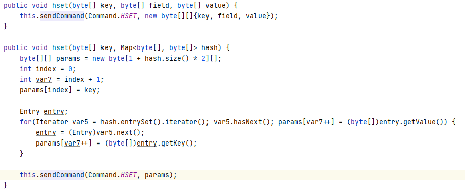
Java的jedis中有2种hset，第一种和console模式一样第二种则map的。

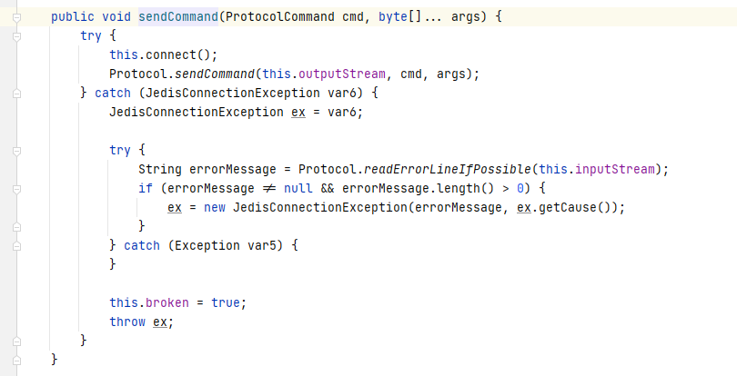
这里的map实际上先转化成map byte然后再转化成行指令在调用hmset，不过hset也可以进行这个操作，hmset在4.0.0后不建议使用。

### list
```
● rpush(key, value)：在名称为key的list尾添加一个值为value的元素
● lpush(key, value)：在名称为key的list头添加一个值为value的 元素
● llen(key)：返回名称为key的list的长度
● lrange(key, start, end)：返回名称为key的list中start至end之间的元素
● ltrim(key, start, end)：截取名称为key的list
● lindex(key, index)：返回名称为key的list中index位置的元素
● lset(key, index, value)：给名称为key的list中index位置的元素赋值
● lrem(key, count, value)：删除count个key的list中值为value的元素
● lpop(key)：返回并删除名称为key的list中的首元素
● rpop(key)：返回并删除名称为key的list中的尾元素
● blpop(key1, key2,… key N, timeout)：lpop命令的block版本。
● brpop(key1, key2,… key N, timeout)：rpop的block版本。
● rpoplpush(srckey, dstkey)：返回并删除名称为srckey的list的尾元素，并将该元素添加到名称为dstkey的list的头部
```

### sort set
```
六,SortedSet（有序集合）
ZADD key score member [[score member] [score member] ...] //将一个或多个 member 元素及其 score 值加入到有序集 key 当中,score 值可以是整数值或双精度浮点数。
ZRANGE key start stop [WITHSCORES] //返回有序集 key 中，指定区间内的成员,位置按 score 值递增(从小到大)来排序,递增排列。
ZREVRANGE key start stop [WITHSCORES] //返回有序集 key 中，指定区间内的成员,位置按 score 值递减(从大到小)来排列,递减排列。
ZRANK key member //返回有序集 key 中成员 member 的排名(返回值+1)。其中有序集成员按 score 值递增(从小到大)顺序排列,score值最小的成员排名为0。
ZREVRANK key member  //返回有序集key中成员 member 的排名(返回值+1)。其中有序集成员按score值递减(从大到小)排序,score 值最大的成员排名为 0 。
ZCARD key //返回有序集 key 的基数。
ZREM key member [member ...] //移除有序集 key 中的一个或多个成员，不存在的成员将被忽略。
ZSCORE key member //返回有序集 key 中，成员 member 的 score 值。
ZRANGEBYSCORE key min max [WITHSCORES] [LIMIT offset count] //返回有序集 key 中，所有 score 值介于 min 和 max 之间(包括等于 min 或 max )的成员。有序集成员按 score 值递增(从小到大)次序排列。min 和 max 可以是 -inf 和 +inf ，这样一来，你就可以在不知道有序集的最低和最高 score 值的情况下，使用 ZRANGEBYSCORE 这类命令。ZRANGEBYSCORE zset (5 (10 表示返回所有符合条件 5 < score < 10 的成员。ZRANGEBYSCORE salary -inf 5000 WITHSCORES    # 显示工资 <=5000 的所有成员
ZCOUNT key min max //返回有序集 key 中， score 值在 min 和 max 之间(默认包括 score 值等于 min 或 max )的成员的数量。
ZINCRBY key increment member //为有序集 key 的成员 member 的 score 值加上增量 increment 。
ZREMRANGEBYRANK key start stop //移除有序集 key 中，指定排名(rank)区间内的所有成员,以 0 表示有序集第一个成员,-1 表示最后一个成员。
ZREMRANGEBYSCORE key min max //移除有序集 key 中，所有 score 值介于 min 和 max 之间(包括等于 min 或 max )的成员。
ZREVRANGEBYSCORE key max min [WITHSCORES] [LIMIT offset count] //返回有序集 key 中， score 值介于 max 和 min 之间(默认包括等于 max 或 min )的所有的成员。有序集成员按 score 值递减(从大到小)的次序排列。
ZUNIONSTORE destination numkeys key [key ...] [WEIGHTS weight [weight ...]] [AGGREGATE SUM|MIN|MAX] //计算给定的一个或多个有序集的并集，其中给定 key 的数量必须以 numkeys 参数指定，并将该并集(结果集)储存到 destination 。
ZINTERSTORE destination numkeys key [key ...] [WEIGHTS weight [weight ...]] [AGGREGATE SUM|MIN|MAX] //计算给定的一个或多个有序集的交集，其中给定 key 的数量必须以 numkeys 参数指定，并将该交集(结果集)储存到 destination 。
```

## redis的spring用法
**redistemplate**
```java
//1、通过redisTemplate设置值
redisTemplate.boundValueOps("StringKey").set("StringValue");
redisTemplate.boundValueOps("StringKey").set("StringValue",1, TimeUnit.MINUTES);

//2、通过BoundValueOperations设置值
BoundValueOperations stringKey = redisTemplate.boundValueOps("StringKey");
stringKey.set("StringVaule");
stringKey.set("StringValue",1, TimeUnit.MINUTES);

//3、通过ValueOperations设置值
ValueOperations ops = redisTemplate.opsForValue();
ops.set("StringKey", "StringVaule");
ops.set("StringValue","StringVaule",1, TimeUnit.MINUTES);

```
# Java基础

**LinkedBlockingQueue**
阻塞队列，尾部进入头部出去，2把锁头锁尾锁，可以2端同时进出，但是不能一端操作多次，同一时刻。
**ImmutableMap**
这里面的元素都是不会变的，所以插入key or value都不能是null。

**CountDownLatch**
类似于一个倒计时的工具，实现底层是共享锁，指定大小，然后调用.await()执行完后释放，继续执行之后的代码。

**LoadingCache**
缓存，在jvm里面的缓存
[link](https://blog.csdn.net/babylovewei/article/details/105556768)
```java
 private static LoadingCache<Long, String> loadCache(CacheLoader<Long, String> cacheLoader) throws Exception {
    LoadingCache<Long, String> cache = CacheBuilder.newBuilder()
        //缓存池大小，在缓存项接近该大小时， Guava开始回收旧的缓存项
        .maximumSize(GUAVA_CACHE_SIZE)
        //设置时间对象没有被读/写访问则对象从内存中删除(在另外的线程里面不定期维护)
        .expireAfterAccess(GUAVA_CACHE_DAY, TimeUnit.DAYS)
        // 设置缓存在写入之后 设定时间 后失效
        .expireAfterWrite(GUAVA_CACHE_DAY, TimeUnit.DAYS)
        //移除监听器,缓存项被移除时会触发
        .removalListener(new RemovalListener<Long, String>() {
          @Override
          public void onRemoval(RemovalNotification<Long, String> rn) {
            //逻辑操作
          }
        })
        //开启Guava Cache的统计功能
        .recordStats()
        .build(cacheLoader);
    return cache;
  }
```
# spring
## 注解
### 如何产生新的注解
spring和Java自带的注解没有办法满足我们所有的需求，我们仍需要新的注解。
```java
@Target({ElementType.METHOD,ElementType.FIELD})
@Retention(RetentionPolicy.RUNTIME)
public @interface requireLogin {
    String name() default "";
}

然后就是设置拦截器他一般有3个部分。
public class loginRequireHandle implements HandlerInterceptor {
    @Override
    public boolean preHandle(HttpServletRequest request, HttpServletResponse response, Object handler) throws Exception {
        
        return false;
    }

    @Override
    public void postHandle(HttpServletRequest request, HttpServletResponse response, Object handler, ModelAndView modelAndView) throws Exception {

    }

    @Override
    public void afterCompletion(HttpServletRequest request, HttpServletResponse response, Object handler, Exception ex) throws Exception {

    }
}

然后就是注册拦截器了。

@Configuration
public class InterceptorTrainConfigurer implements WebMvcConfigurer {
    @Override
    public void addInterceptors(InterceptorRegistry registry) {
        registry.addInterceptor(new loginRequireHandle()).addPathPatterns("/**");
    }
}

他的逻辑是进入首先进入拦截器，然后进行prehandle判断能否进入，这个地方就可以设置注解的东西了。

   @Override
    public boolean preHandle(HttpServletRequest request, HttpServletResponse response, Object handler) throws Exception {
        System.out.println("进入拦截器了");
        HandlerMethod handlerMethod= (HandlerMethod) handler;
        requireLogin login=handlerMethod.getMethod().getAnnotation(requireLogin.class);
        if(login==null)
        return true;

        String name=request.getParameter("name");
        System.out.println(name);
        if(name.equals("liuyi"))
            return true;
        response.setContentType("application/json; charset=utf-8");
        response.getWriter().println("你所需的资源需要登陆");
        return false;
    }
    可以先判断有没有该注解，没有直接返回true有的话进一步判断逻辑，完成后返回结果。

```

**@ControllerAdvice**
这是对错误处理的截断，如果执行出错就会进行跳转到类里继续执行/
**@ExceptionHandler**
在上一条指令里面可以设置参数执行对应错误的放回。其实我以为如果这个在出错就会递归执行，但没想到我的想法被他看透了，出错了只能执行一次然后直接返回500抛出异常。
**@Service**
bean需要注入，通过service相当于做了2件事情将名字与类型进行注入，可以在后面指定他的id。他匹配过程是按照类型，如果需要按照id用@Qualifier 
**@Configuration**
配置了注入，类似于xml文件。@bean会在开始运行的时候自动运行。
**@Bean**
将函数生产的对象放入ioc容器中，把控制权限交给spring。
**@Component**
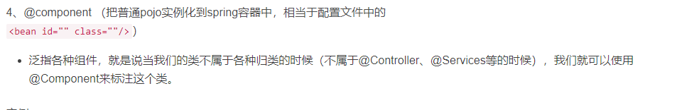
**@Transactional**
支持事务，可以进行回滚，支持多种事务。
[link](https://developer.ibm.com/zh/languages/java/articles/j-master-spring-transactional-use/)
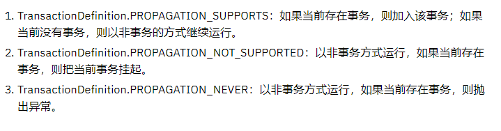

个人理解：
注解可以是需要配置拦截器进入的，进入后会进行配置，拦截器前面讲到过的，而是用代理去操作肯定是有原因的，至于为啥也不知道。
**@Qualifier**
可以准确找到那个bean决定用那个bean进行实例化。
**@Order**
并不是控制bean初始化的时间，而是控制注入的顺序。
**@Value**
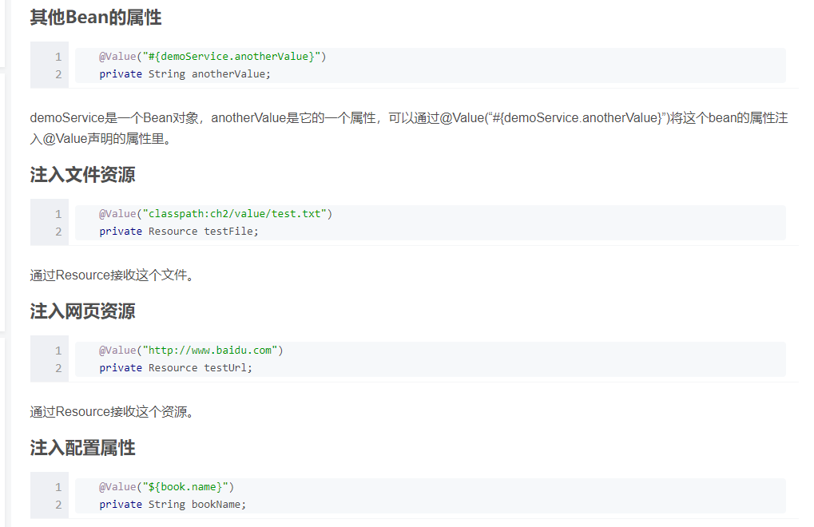
## end

# mybaits
[link1](https://www.kancloud.cn/digest/andyalien-mybatis/190189)
**trim**
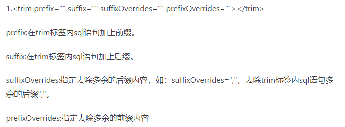
**refid**
\<include refid="Base_Column_List"/>
\<sql id="Base_Column_List" >name,age\</sql>
就是把Base_Column_List里面的内容copy过来。

**resultmap**
设置返回结果的类似。

**select parament**
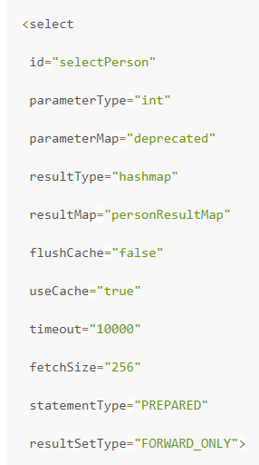
如果要返回list\<obejct>只需要设置类路径+object即可。
resultmap和resulttype不能同时存在。

## sql record
**DESC**
逆序，使某个字段按照逆序排列。
**order by**
可以按照某一列排序。
select * from table order by a,b,c
和联合索引类型。

**group by**
把一个字段相同的分在一起，然后进行一些操作。
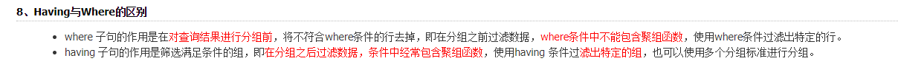
# rabbitmq
参考链接
https://developer.aliyun.com/article/769883

消息队列优点。解耦、异步、削峰。

## 组成
Broker：消息队列服务进程。此进程包括两个部分：Exchange和Queue。
Exchange：消息队列交换机。按一定的规则将消息路由转发到某个队列。
Queue：消息队列，存储消息的队列。
Producer：消息生产者。生产方客户端将消息同交换机路由发送到队列中。
Consumer：消息消费者。消费队列中存储的消息。


## 函数
**Queue**
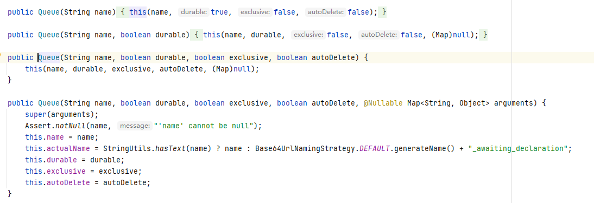
```
1. name队列名称
2. durable持久化，是队列持久化，并不是里面的消息持久化。
3. exclusive队列是否专属,专属的范围针对的是连接,也就是说,一个连接下面的多个信道是可见的.对于其他连接是不可见的.连接断开后,该队列会被删除.注意,不是信道断开,是连接断开.并且,就算设置成了持久化,也会删除.
4. autodelete//如果所有消费者都断开连接了,是否自动删除.如果还没有消费者从该队列获取过消息或者监听该队列,那么该队列不会删除.只有在有消费者从该队列获取过消息后,该队列才有可能自动删除(当所有消费者都断开连接,不管消息是否获取完)

最后一个是一个map
Message TTL : 消息生存期
Auto expire : 队列生存期
Max length : 队列可以容纳的消息的最大条数
Max length bytes : 队列可以容纳的消息的最大字节数
Overflow behaviour : 队列中的消息溢出后如何处理
Dead letter exchange : 溢出的消息需要发送到绑定该死信交换机的队列
Dead letter routing key : 溢出的消息需要发送到绑定该死信交换机,并且路由键匹配的队列
Maximum priority : 最大优先级
Lazy mode : 懒人模式
Master locator : 
## exchange
exchange是一种映射规则，将key指定到value这里就是queue。这样可以保证同样的key是有序的。
* direct
* fanout
* topic
* headers
```
**bind** 
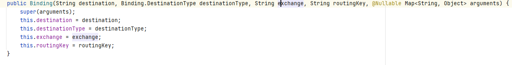
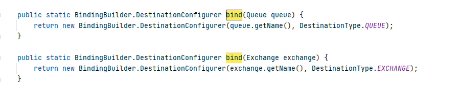
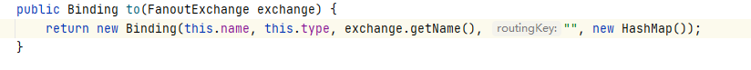

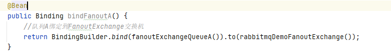

这里网上资料很少，大概是把queue绑定到交换机上面去。还有路由键。应该就是路由链整个过程。

**convandsend**


### direct
**DirectExchange**
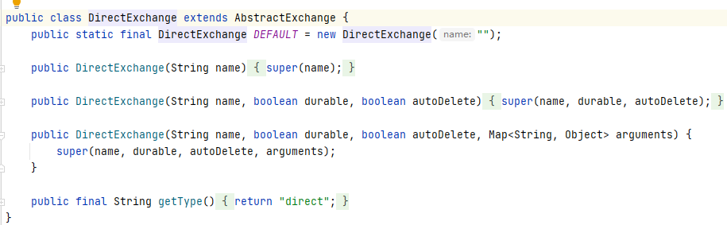
就是直接连接，发现相同的key就可以连接消费了。而且消息会被抢掉，如果没有及时的消费。
主要步骤

1. 建立tcp链接形成channel
2. 建立消息队列，交换机
3. 将消息队列和交换机链接
4. 通信

### fannot
这个交换机可以多订阅多发布，
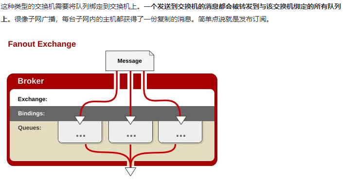

### topic
topic相对于其他的exchange来说，他的roukey可以通过通字符匹配完成匹配。每个队列都有一个自己的名字。

### 消费者
这里可以指定队列进行消费。如果没有指定队列就不会进行消费。
```java
@Component
@RabbitListener(queuesToDeclare = @Queue(topConfig.TOPIC_EXCHANGE_QUEUE_A))
public class topicconsumer {
    @RabbitHandler
    public void getmsg(Map<String,Object> map){
        System.out.println(topConfig.TOPIC_EXCHANGE_QUEUE_A+map.toString());
    }
}

```


# error record
## Failed to determine a suitable driver class
[link](https://blog.csdn.net/buyaore_wo/article/details/80741159)
这里继续说没有合适的database。
错误原因是在initial的时候选择spring web的时候会导致连带jdbc选择而本机器未安装MySQL的就会导致错误。

1. 取消选择jdbc
3. 注解掉相关的maven依赖

## org.apache.ibatis.binding.BindingException: Invalid bound statement (not found)
[link]("https://blog.csdn.net/sundacheng1989/article/details/81630370")
基本涵盖。不过我是test里面，有同名文件导致的。